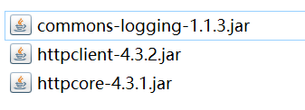

### 1.全面剖析网络爬虫    

#### 1.URI&URL的区别  

URI又叫统一资源标识符，用来唯一的标识一个资源，是一种抽象的标识方式。而URL是统一资源定位器，是一种具体的资源标识方式。URL是URI的一个特例，它包含了定位Web资源的足够信息。  

#### 2.URL示例   

1. Http的URL示例   

``http://www.rol.cn.net/talk/talk1.htm``  

2. 文件的URL示例   

``file://ftp.yoyodyne.com``  

爬虫主要就是根据URL取得重要的文件内容，对它进行进一步的处理。   

#### 3.抓取网络内容   

1. 原生方式     

java自带的java.net.URL包可以构造URL对象，通过URL对象再来获取网络流，进而操作网络资源。   

```java
		URL pageURL=new URL("http://www.baidu.com");
		InputStream stream=pageURL.openStream();
```

2. HttpClient方式   

用java.net来模拟IE访问代码量比较大，需要处理：状态码，设置代理，处理协议等。  

所以实际中更多的是使用HttpClient。    

#### 4.HttpClient的使用方式

1. 导入基础jar包  


   

[基础jar包](../JarPackage/base)   

2. 编写java代码（Get方式请求）     

```java
		//创建客户端（打开浏览器）  
		CloseableHttpClient httpclient=HttpClientBuilder.create().build();
		//Get方式，输入地址
		HttpGet httpget=new HttpGet("http://www.baidu.com/");
		//获取得响应   
		HttpResponse response=httpclient.execute(httpget);
		//查看命中的情况:获取状态码
		System.out.println("response="+response.getStatusLine().getStatusCode());
		//释放连接
		httpget.releaseConnection();
```

当状态码为200表示客户端请求已成功。   

Get是将参数作为URL的一部分传给服务器，由于Http对URL长度有所限制，所以一般用Post方式进行http请求   

3. Post方式请求  

Post方式请求可以使用NameValuePair传递参数，可以传递无限多个。   

4. 代理服务器   

有些web资源不能直接访问，需要通过HttpClient设置代理，只需输入代理服务器IP，端口，用户名密码即可。

（此处详细内容日后补上）   
