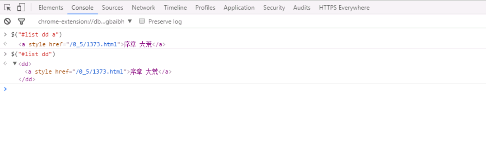

# Java小说爬虫

### 1.依赖的jar包  

- jq操作网页元素的jar包：jsoup   
- http-client

依赖包查找的网站：http://mvnrepository.com/

```
  <dependencies>
	<!-- https://mvnrepository.com/artifact/org.jsoup/jsoup -->
	<dependency>
	    <groupId>org.jsoup</groupId>
	    <artifactId>jsoup</artifactId>
	    <version>1.7.3</version>
	</dependency>
	
	<!-- https://mvnrepository.com/artifact/org.apache.httpcomponents/httpclient -->
	<dependency>
	    <groupId>org.apache.httpcomponents</groupId>
	    <artifactId>httpclient</artifactId>
	    <version>4.5.3</version>
	</dependency>
	
	<!-- https://mvnrepository.com/artifact/dom4j/dom4j -->
	<dependency>
	    <groupId>dom4j</groupId>
	    <artifactId>dom4j</artifactId>
	    <version>1.6.1</version>
	</dependency>
	
	<!-- https://mvnrepository.com/artifact/junit/junit -->
	<dependency>
	    <groupId>junit</groupId>
	    <artifactId>junit</artifactId>
	    <version>4.12</version>
	</dependency>
  </dependencies>
```

- 检验jq选择器是否能获取到元素内容：  



###    2.获取元素转化为json数据  

#### 1.新建maven工程    

Java Build Path & Java Compiler修改为1.7  

#### 2.新建Chapter的model对象   

- 属性：

```java
private String title;
private String url;
```
- 添加版本号，添加equals，添加toString

#### 3.新建接口层  

```java
public interface IChapterSpider {
	/**
	 * 给url地址，返回所有章节列表
	 * @param url
	 * @return
	 */
	public List<Chapter> getsChapter(String url);
}
```

#### 4.实现接口层   

```java
	@Override
	public List<Chapter> getsChapter(String url) {
		try {
			String result=crawl(url);
			Document doc=Jsoup.parse(result);
			Elements as=doc.select("#list dd a");
			List<Chapter> chapters=new ArrayList<>();
			for(Element a:as){   //遍历拿到的标签
				Chapter chapter=new Chapter();
				chapter.setTitle(a.text());
				chapter.setUrl("http://www.bxwx8.org"+a.attr("href"));
				chapters.add(chapter);
			}
			return chapters;
		} catch (Exception e) {
			throw new RuntimeException(e);
		}
	}
```

```java
	protected String crawl(String url) throws Exception{
		try(CloseableHttpClient httpClient=HttpClientBuilder.create().build();
			CloseableHttpResponse httpResponse= httpClient.execute(new HttpGet(url))){  //放进try里可以自动释放资源
			String result=EntityUtils.toString(httpResponse.getEntity());   //返回抓取的结果
			return result;
		}catch(Exception e){
			throw new RuntimeException(e);
		}
	}
```

代码解析：


#### 5.编写Test方法    

在test目录下   

```java
	@Test
	public void test1() throws Exception{
		IChapterSpider spider=new DefaultChapterSpider();
		List<Chapter> chapters= spider.getsChapter("http://www.biquge.tw/0_5/");
		for(Chapter chapter:chapters){
			System.out.println(chapter);
		}
	}
```

输出的对象由于toString会显示属性在控制台上面   


